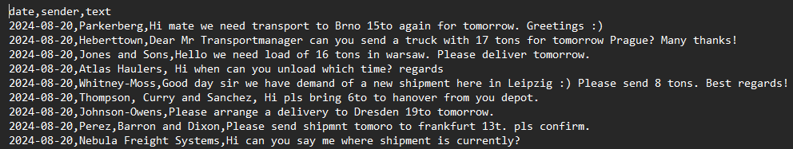
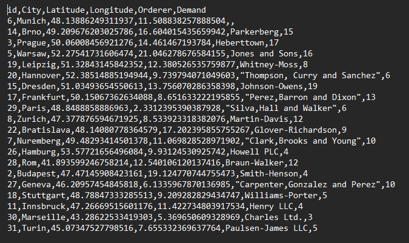
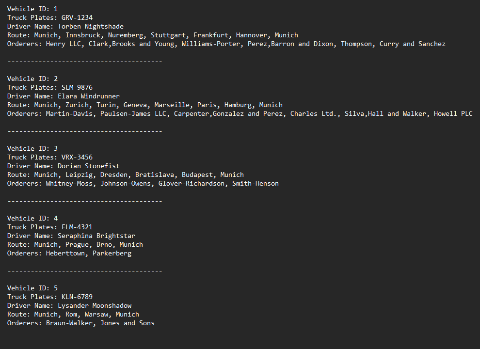
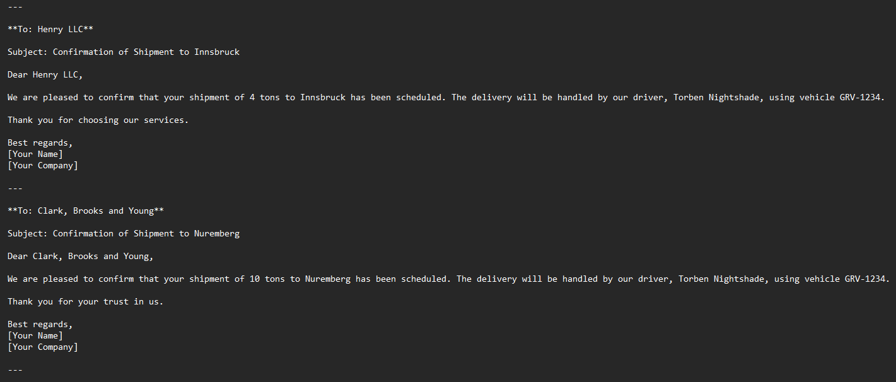

# AI Agents Route Optimization

This project is a solution for a transport company for the process of extracting relevant transport order mails with the help of an AI-Assistant, creating routes on the basis of VRP and dispatching them to drivers and finally create confirmation mails created by an AI-Assistant. The company has a central depot and allocates transport orders to different drivers based on the created routes.

1. The company receives daily lot of mails which are collected in the _orders.csv_ file. Firstly, an OpenAI API decides which are valid orders (not just e.g. inquiries) and then extracts the relevant information like delivery destination, the orderer and the demanded weight of goods. Since the VRP algorithm needs coordinates, an API for this was simulated by creating the _coordinates_database.csv_ file which contains coordinates to a list of many selected european cities. The Assistant accesses this file too and compares the cities with those in the file in order to collect the respective coordinates. Next, these informations become gathered in the _output.csv_ file.

2. Then, on the basis of the _output.csv_ a VRP with a nearest neighour algorithm determines routes considering the demand of each node and the capacity of each vehicle (meaning what can be carried on the route). The functions for this are in the _vrp.py_ file. Then, each route gets assigned to a driver and the respective truck plates from the _vehicle.csv_. After this, a file _all_tours.txt_ is created by writing a overview section for each tour with the vehicle ID, truck plates, driver name, the sequence of the route delivery stations and the respective orderers. 

3. Finally, a second AI-Assistant creates individual confirmation mails for each orderer which contain vehicle driver name and the truck plates which are saved in _confirmation.csv_. The prompts for both Agents are stored in _prompts.py_.

Project content:

- _main.py_
- _prompts.py_
- _vrp.py_
- _coordinates_database.csv_
- _orders.csv_
- _vehicles.csv_
- _confirmation_mails.csv_
- _output.csv_
- _all_tours.txt_
- _requirements.txt_

## Getting started

To set up this repo create a folder for the project on your system (instructions for windows), open a terminal window, write "cd" and paste the folder path `cd "C:\Users\user\path\to\your\folder"`. Then type `git clone https://github.com/Yesitin/AI-Agents-Route-Optimization.git` to download the whole repository (ensure that you have installed python and git). 

Next, create a virtual environment in order to avoid dependency conflicts. For this, type into the terminal `python -m venv env`. With `env\Scripts\activate` you start the environment.

Now you can install all dependencies with `pip install -r requirements.txt`. 

As a last step, you have to create a .env file and insert and OpenAI key: `OPENAI_API_KEY=your_api_key`. Replace _your_api_key_ with your actual key.

# Example

1. A lot of mails are incoming. Most of them are orders but not all of them:

2. Agent extracts all relevant data out of a order mail, adds the respective coordinates from _coordinates_database.csv_ and finally creates a table with all order information:

3. The VRP creates routes and assigns them to drivers and their truck plates (found in _vehicles.csv_):

4. Finally, a second Agent creates confirmation mails to each sender of an order:

